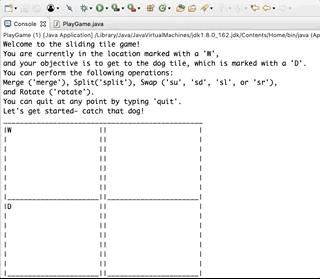
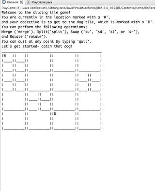
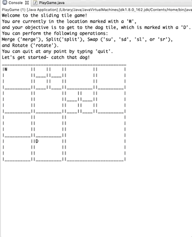

# 'Lost Dog' Sliding Quadtree Puzzle

Lost Dog is an interactive game that simulates a dog walker trying to find a lost dog. 
The dog walker ('W' on the game board) searches in a two dimensional grid for the dog ('D' on the game board). The objective of the game is for the user to move the dog walker from tile to tile around the grid until it is in the same tile as the dog. 
If the dog is found, the user wins the game.

The game is implemented using a Point-Region QuadTree datastructure. The Composite design pattern was used (every Tile object can be either an InternalTile or LeafTile).

This was a final project for CIT594 (Data Structures &amp; Software Design) at UPenn.

## Getting Started

These instructions will get you a copy of the project up and running on your local machine for development and testing purposes.

### Prerequisites

You will need the following software to run this code:

```
Eclipse (or other Java IDE)
```
```
JDK
```
```
JUnit
```

### Installing

In order to use Java, you need to first install the Java Development Kit (JDK).

You’ll also need the Java Runtime Environment (JRE) which includes the
Java Virtual Machine (JVM).

You can download and install the JDK, which includes the JRE (and JVM) [here](https://www.oracle.com/technetwork/java/javase/downloads/jdk8-downloads-2133151.html)

Eclipse is one of two main IDEs for Java development.

You can download and install Eclipse [here](https://www.eclipse.org/downloads/)

Once Java and Eclipse are installed, download the src/slidePuzzle folder.

Create a new Java project in Eclipse:
```
File > New > Java Project
```

And name this project slidePuzzle. Within this project, create a new package:

```
File > New > Package
```

And name this package slidePuzzle. Within this package, create the 9 classes listed in the src folder and import the code.

## Playing the game

The ```main``` method is contained within PlayGame.java. You can generate randomized starting boards:



Merge, split, swap and rotate to catch the dog!



Error checking for illegal moves is done through the ```main``` method:



## Running the tests

There are 3 testing files for this game: ```InternalTileTest.java```, ```LeafTileTest.java```, and ```GameBoardTest.java```.

### InternalTileTest & LeafTileTest

These files test split, swap, merge, rotate and isLeaf operations for their respective classes. Since
both classes implement the Tile interface, they contain the same methods.

### GameBoardTest

This file tests findParent (finds any tile's parent tile), updateDisplay (searches for LeafTile objects
and updates their UI accordingly), populateDis (populates initial game board with blank spaces), and wipeDisplay (clears UI between moves). We didn't test createTree, placeDog or placeWalker because they are randomized methods and we didn't test printBoard because it simply prints to the console. Since
GameBoard.java implements the Game interface, it implements all the methods contained within this interface, plus a few private helper methods.

## Versions

We used the following software versions:

* Java 8.0
* JUnit 4
* Eclipse Oxygen.2 Release (4.7.2)

## Authors

* **Noah Hindes** - *Randomized Tree Generation* - [GitHub](https://github.com/hindesn)
* **Hunter Kelley** - *User Interface* - [GitHub](https://github.com/h-b-k)
* **Naomi Pohl** - *InternalTile methods and tests* - [GitHub](https://github.com/naomipohl)
* **Catherine Weiss** - *LeafTile methods and tests* - [GitHub](https://github.com/catherineweiss)

## License

This project is licensed under the MIT License - see the [LICENSE](LICENSE) file for details

## Acknowledgments

* Professor [Eric Fouh](https://www.seas.upenn.edu/directory/profile.php?ID=253)
* Yang Liu
